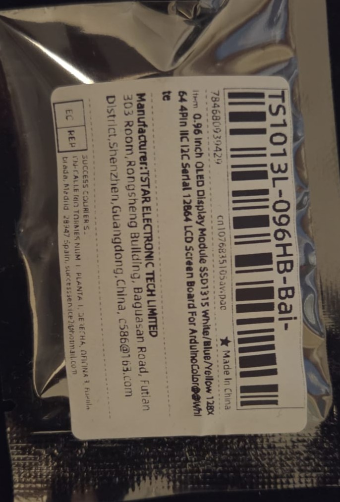
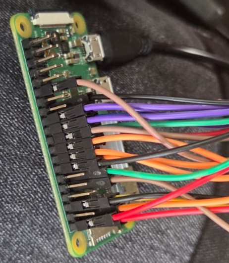
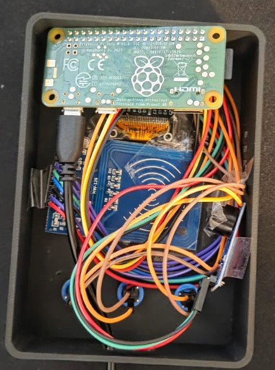
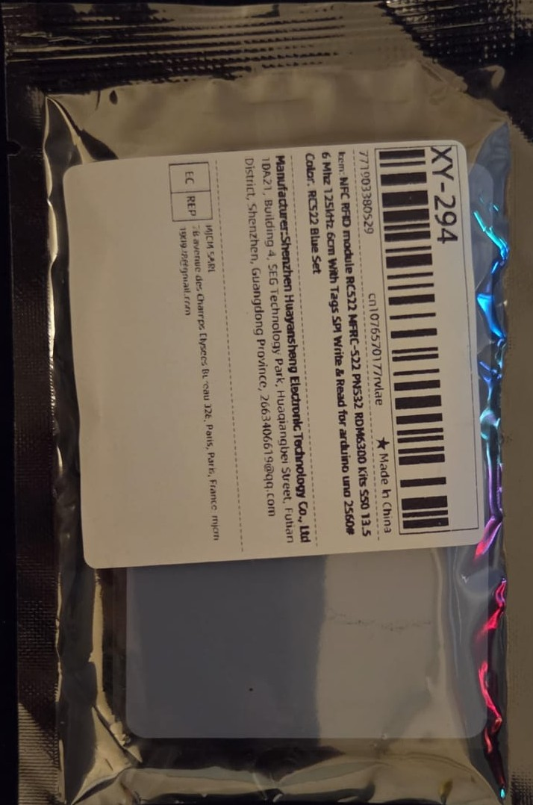
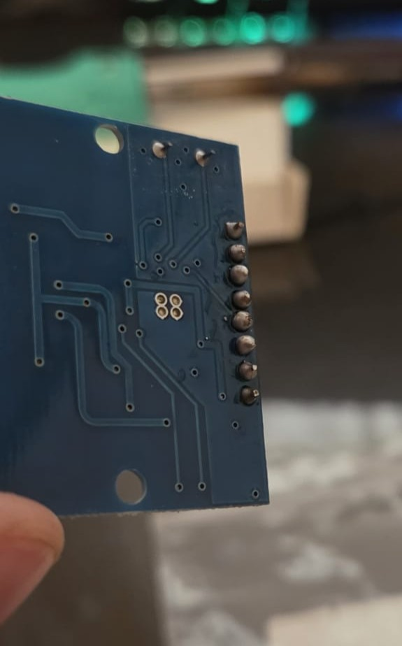
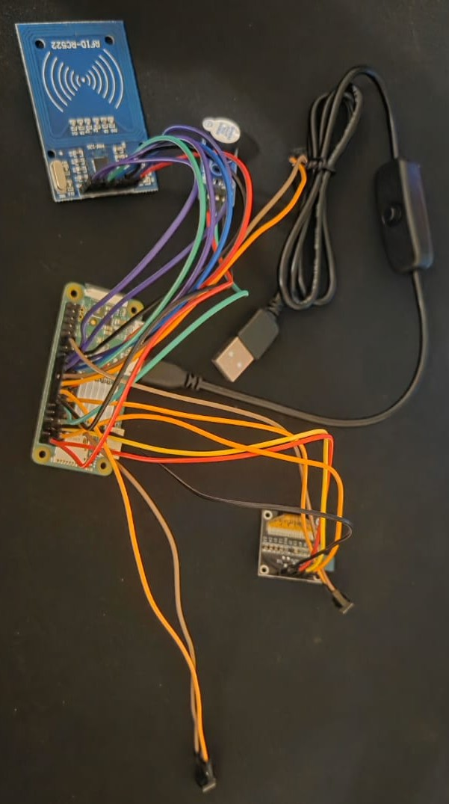
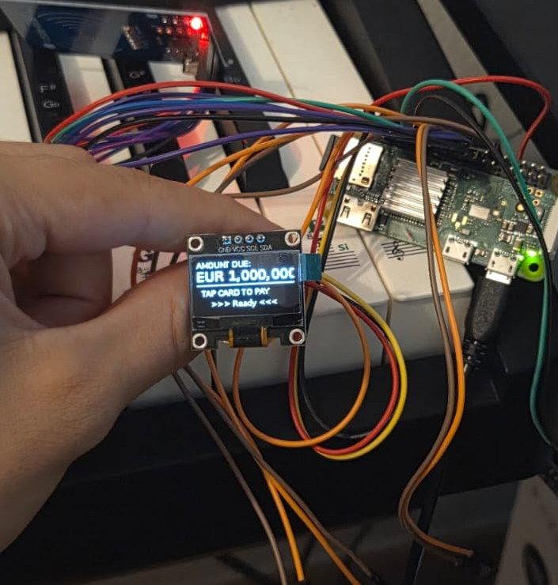
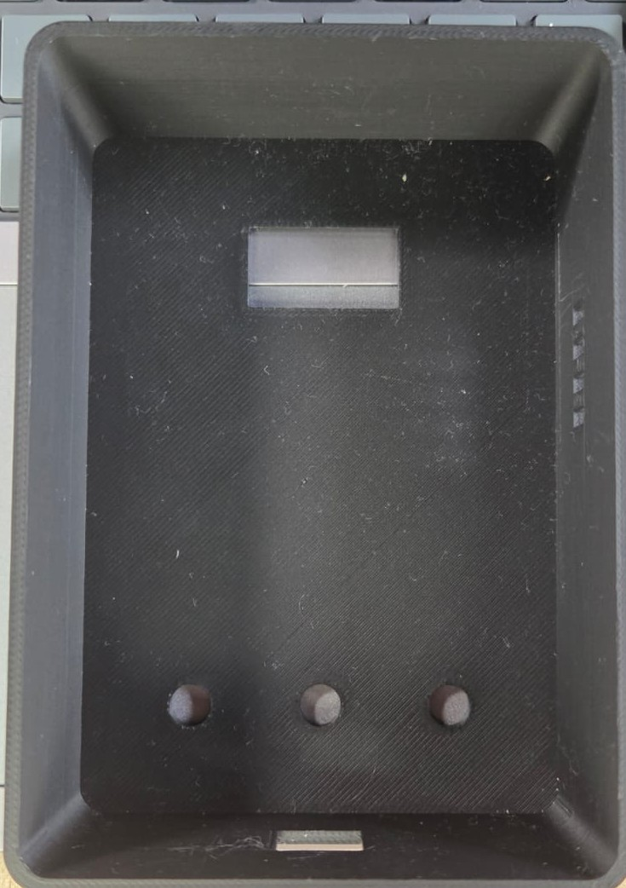
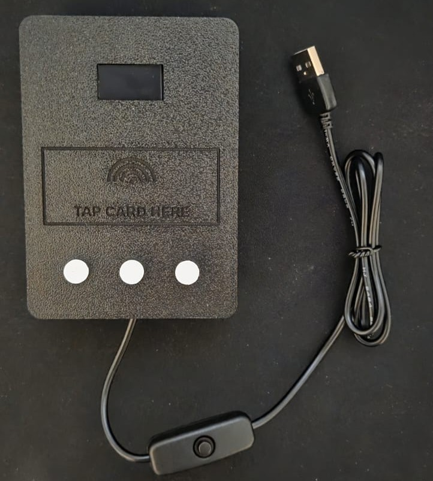

# Wedding POS Terminal

A fake payment terminal that demands an absurd sum before it will "approve" a
transaction — built on a Raspberry Pi Zero WH, sealed in a custom 3D-printed
case, and powered by a pocket power bank.

It was a wedding prank: before the groom could "collect" the bride, he had to
tap a card and pay. The terminal beeps, shows a very official *CONTACTING BANK…*
progress bar, thinks hard for a few seconds, then flashes **PAYMENT APPROVED**
with a custom message. No money moves. No network is involved. It's pure
theatre — a self-contained prop that looks and sounds exactly like the real
thing.



---

## What it does

The whole experience is one clean loop, no operator required:

```
idle screen  →  tap card  →  "Card detected!"  →  processing animation  →  APPROVED  →  back to idle
```

- **Idle:** the OLED shows the amount due (default `10,000.00 EUR`) and *TAP CARD
  TO PAY*.
- **Tap:** an RFID card enters the reader's field. Short confirmation beep, then
  *Card detected! / Authorising…*
- **Processing:** a *CONTACTING BANK…* screen with animated dots and a filling
  progress bar — the part that sells it.
- **Approved:** a double-then-long success beep, a boxed **APPROVED** screen, and
  your custom two-line message.
- Then it quietly returns to idle, ready for the next mark.

Any 13.56 MHz card or fob triggers it — the code detects a card in the field
rather than validating a specific UID, so a hotel key card works just as well as
the bundled fobs.

---

## Hardware

| Part | Role |
|------|------|
| Raspberry Pi Zero WH | Brains — runs the Python app headless |
| SSD1306 0.96" OLED (I2C) | The terminal display |
| RC522 RFID reader (SPI) | Detects the card tap |
| Active buzzer | The beeps |
| 3× tactile buttons | Decorative — present on the case, ignored in code |
| USB power bank + inline-switch cable | All-day, cable-free power |

Full parts list with prices in **[hardware/bom.md](hardware/bom.md)**.

---

## Wiring

Seven components share the 40-pin header across I2C, SPI, and plain GPIO. The
one thing you must not get wrong: **the RC522 is a 3.3V part — 5V will kill it.**

Full pin table lives in **[docs/setup.md](docs/setup.md)**; the visual version is
**[hardware/wiring_diagram.svg](hardware/wiring_diagram.svg)**.



---

## The enclosure

The case is a parametric **OpenSCAD** design, printed in black PLA on an FDM
printer. It's three separate parts, each exported to its own STL:

1. **Main shell** — front face with the OLED window, an engraved *TAP CARD HERE*
   zone with an NFC-style ripple symbol, three button holes, and a side USB slot.
2. **Back lid** — snap-in rear cover with a cutout for the power cable.
3. **Button caps** (×3) — printed individually with different engraved labels.

Because every dimension is a named variable at the top of the file, the whole
box re-sizes cleanly if you swap a module or change wall thickness. Source:
**[hardware/pos_terminal_case.scad](hardware/pos_terminal_case.scad)**.

> **On the buttons:** in the final build the button caps are a design feature,
> not a mechanism — there are no return springs behind them, so they don't
> actuate. That was a deliberate call: the prank runs fully automatically, so
> the buttons only need to *look* like a card terminal. A small
> [retainer disc](hardware/button_retainer.scad) keeps each cap from falling out
> the front.



---

## Software

Runs headless on **Raspberry Pi OS Lite**. Quick version:

1. Flash OS Lite, enable SSH + WiFi in the imager.
2. `raspi-config` → enable **SPI** and **I2C**.
3. `pip install luma.oled mfrc522 RPi.GPIO spidev`.
4. Drop `pos_terminal.py` on the Pi, edit the config block (amount, currency,
   messages).
5. Auto-start it with a `@reboot` crontab entry.

Full walkthrough — flashing, headless config, wiring, autostart — in
**[docs/setup.md](docs/setup.md)**.

Everything the user personalises is at the top of the script:

```python
AMOUNT          = "10,000.00"
CURRENCY        = "EUR"
APPROVED_LINE1  = "Congratulations!"
APPROVED_LINE2  = "Enjoy the show ;)"
PROCESSING_SECS = 4
```

---

## Build process

The project went from "wouldn't it be funny if…" to a working prop in a handful
of evenings:

**1. Research & parts.** Figured out the display, reader, and buzzer that would
play nicely with a Pi Zero, then ordered them.



**2. Soldering.** The RC522 ships with a loose header strip — soldered it on so
it could take jumper wires.



**3. Wiring.** Connected all seven components to the 40-pin header — OLED on I2C,
RC522 on SPI, buzzer and buttons on GPIO — and checked each subsystem as I went.




**4. Modeling the case.** Designed the enclosure parametrically in OpenSCAD,
measuring each module so the internal cavities actually fit.

**5. Printing.** FDM printed in black PLA, face-down, and dialed in the tolerances
on the OLED window and button holes.

**6. Assembly.** Everything folded into the shell — Pi, reader behind the *TAP
CARD* zone, OLED in its window, buzzer, power bank cable out the bottom.



**7. It worked.** Powered from a bank, booted, tapped a card — beep, animation,
**APPROVED**.



---

## Tech highlights / what I learned

- **I2C OLED rendering** with `luma.oled` — driving an SSD1306 frame-by-frame via
  its `canvas` context, laying out text and shapes within 128×64 pixels (and
  fixing a real overflow bug by splitting the amount onto its own line).
- **SPI RFID** with the `mfrc522` library — bringing up the reader on the SPI bus
  and detecting card presence reliably.
- **Non-blocking card detection.** `SimpleMFRC522.read()` blocks until a card
  arrives, which would freeze the idle animation. Instead the main loop polls the
  underlying reader directly with `MFRC522_Request(PICC_REQIDL)` and only advances
  when a card is actually in the field — so the UI stays responsive.
- **GPIO buzzer** timing — composing distinct beep patterns (tap vs. approval)
  from simple HIGH/LOW pulses.
- **Headless Raspberry Pi** setup — imager pre-config, SSH, enabling SPI/I2C,
  and `@reboot` cron autostart (learning the hard way that `rc.local` is gone on
  Bookworm).
- **Parametric 3D modeling** in OpenSCAD — driving the whole enclosure from named
  variables, and building an NFC ripple symbol out of arc primitives.
- **FDM printing tolerances** — getting press-fit windows and button holes to the
  right size after accounting for how the printer over-extrudes on small holes.

---

## Repository structure

```
wedding-pos-terminal/
├── pos_terminal.py            # the application
├── README.md
├── LICENSE
├── docs/
│   └── setup.md               # full build + install guide
├── hardware/
│   ├── bom.md                 # bill of materials
│   ├── wiring_diagram.svg     # pin-by-pin wiring
│   ├── pos_terminal_case.scad # parametric enclosure (3 parts)
│   └── button_retainer.scad   # button cap retainer discs
└── images/
    ├── build/                 # build-process photos
    └── product/               # component / product shots
```

---

## License

MIT — see [LICENSE](LICENSE). Do fun things with it. No real payments, please.
